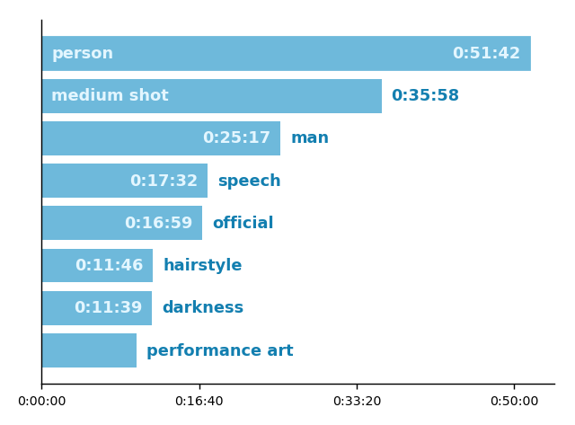

# Valossa Metadata Reader
Helper tool for reading Valossa Core video metadata. You can also look at the
code to get insights for writing your own code for reading Valossa Core video
metadata in your application.

This tool allows you to get familiar with the metadata contents and gives you
examples of getting the contents visible. If you are a developer, this tool and
source code of it can be useful as reference.

If you are not familiar with Valossa Labs, please visit our website at
[**valossa**.com](https://valossa.com/) for more information.

# Table of contents

* [Getting started](#getting_started)
    - [Prerequisites](#prerequisites)
    - [Installation](#installation)
    - [First use](#first_use)
* [Features](#features)
    - [List detections](#list_detections)
    - [List detections by second](#list_detections_by_second)
    - [Summary](#summary)
    - [Plot](#plot)
    - [Metadata info](#metadata_info)
* [Quick help](#tldr)


<a id="getting_started"></a>
## Getting started

These instructions walk you through from installation to first use case.

<a id="prerequisites"></a>
### Prerequisites

The program has been written with [Python 2.7](https://www.python.org/) so to
make sure the Python is installed, you can run

```
python --version
```

to see the version installed on your machine.

If you wish to use plotting options, you need to have the `matplotlib` package.
The program has been tested with versions 1.5.3 and 2.1.0. The version installed on
your machine can be checked in the following way:

```
python
...
>>> import matplotlib
>>> matplotlib.__version__
'2.1.0'
```

If you don't have the `matplotlib` yet, the following message should appear.

```
Traceback (most recent call last):
  File "<stdin>", line 1, in <module>
ImportError: No module named matplotlib
```

In this case you can install the package using pip, for example:

```
pip install matplotlib
```
<a id="installation"></a>
### Installation

**First choice:**<br>
Download the package from
[github.com](https://github.com/valossalabs/metadata-reader) and use as script
without installing.

**Second choice:**<br>
Download the package from
[github.com](https://github.com/valossalabs/metadata-reader) and run the following
command.

```
python setup.py install
```

<a id="first_use"></a>
### First use

Depending on installation choice earlier you need to start the program with `python
metareader`, `python -m metareader` respectively. For the rest of this document,
we will use just `metareader`.

Test if the program has been installed properly into your machine. The following command
lists the available arguments.

<details>
<summary><sub>Click to see expected output</sub>

```
metareader --help 
```
</summary>

Expected output:

```
usage: metareader [-h] MODE ...

Helper tool to read Valossa Core metadata.

positional arguments:
  MODE                  Select one of the following modes.
    list-detections     List detections without looking into the by_second
                        structure.
    list-detections-by-second
                        List detections for each second, by looking into the
                        by_second structure (note: this obviously lists only
                        time-bound detections, so for example IAB categories
                        are NOT listed in this mode)
    metadata-info       List information about metadatafile
    summary             Create summary view of detections based on total
                        occurrence time of the detections. Percent values are
                        related to total length of the video.
    plot                Plot chosen metadata type into bar chart. Output will
                        be saved to a file.

optional arguments:
  -h, --help            show this help message and exit

A few example commands:
metareader summary metadata_example.json -f free -n10
metareader list-detections metadata_example.json -t"*name.location"
```
</details>

Finally, let's test the mode `summary`. All possible optional arguments can be
seen with `--help` argument.

<details>
<summary><sub>Click to see expected output</sub>

```
metareader summary --help 
```
</summary>

Expected output:

```
usage: metareader summary [-h] [--min-confidence FLOAT] [-f {free,csv}]
                          [-t TYPE] [-n N] [--separate-face-identities]
                          [--skip-unknown-faces]
                          metadata_file

positional arguments:
  metadata_file         Valossa Core metadata file to examine

optional arguments:
  -h, --help            show this help message and exit
  --min-confidence FLOAT
                        Specify minimum confidence from 0.5 to 1. Valossa
                        metadata does not have entries below 0.5 confidence.
                        Note that some detection types does not have
                        confidence field and in that case this argument is
                        ignored.
  -f {free,csv}, --output-format {free,csv}
                        Choose one of the supported output formats.
  -t TYPE, --detection-type TYPE
                        Detection type to read
  -n N, --n-most-prominent-detections-per-type N
                        List only N most prominent detections from each
                        detection type, N given by user
  --separate-face-identities
                        Summary merges human.face identities with same
                        similar_to -field. Use this if you wish to prevent
                        this merging.
  --skip-unknown-faces  Remove the human.face detections missing similar_to
                        -field from listing.
```
</details>

Example command would be:

<details>
<summary><sub>Click to see expected output</sub>

```
metareader summary metadata_example.json -f free -n5 
```
</summary>

Expected output:

```
Detection type: human.face
Name                      Time (s)   Confidence    Of video length
-----------------------------------------------------------------
Audrey Hepburn            1128.350        0.968             16.55%
Cary Grant                 643.655        0.757              9.44%
unknown male (det id: 3)   223.563            -              3.28%
unknown male (det id: 4)    92.075            -              1.35%
unknown male (det id: 5)    76.980            -              1.13%


Detection type: visual.context
Label                           Time (s)    Of video length
-----------------------------------------------------------
person                            3102.0             45.51%
medium shot                       2158.0             31.66%
man                               1517.0             22.26%
speech                            1052.0             15.43%
official                          1019.0             14.95%


```
</details>

Here I used shorter versions of `--output-format` and
`--n-most-prominent-detections-per-type` arguments. The resulting output shows a
summary for `human.face` and `visual.context`.

<a id="features"></a>
## Features

This section provides information about specific features the program has with
examples on writing the commands. Most optional arguments can be combined with
each other to create a more specific listing.

<a id="list_detections"></a>
### List detections

This feature lists every detection in the metadata file. Without extra arguments
the usage looks like this:

<details>
<summary><sub>Click to see expected output</sub>

```
metareader list-detections metadata_example.json 
```
</summary>

Expected output:

```
detection ID,detection type,label,Valossa concept ID,GKG concept ID,more information
480,audio.context,speech,k1rchz3QwDwk,/m/09x0r,
479,audio.context,music,F4TQO8tKYNSL,/m/04rlf,
485,audio.context,vehicle,cdFj-biWrPDP,/m/07yv9,
494,audio.context,"male speech, man speaking",95bag2repe3d,/m/05zppz,
491,audio.context,musical instrument,mExJ3wmZBcJO,/m/04szw,
482,audio.context,"violin, fiddle",L4886H9GucE_,/m/07y_7,
500,audio.context,tap,UWYzy7a1t5Zs,/m/07qcpgn,
490,audio.context,percussion,5hstbMWSpqUI,/m/0l14md,
525,audio.context,"narration, monologue",98AzjqvqwH-Q,/m/02qldy,
481,audio.context,bird,azM7oyzc_KMK,/m/015p6,
486,audio.context,train,elh5BPSJdVep,/m/07jdr,
505,audio.context,"pigeon, dove",8bxvUpUrjOyH,/m/0h0rv,
489,audio.context,tabla,8qrUQcApQhC6,/m/01p970,
503,audio.context,salsa music,1RYV2B8M9PT_,/m/0ln16,
487,audio.context,rail transport,32IH9oNObPFr,/m/06d_3,
495,audio.context,vibraphone,Towc7p5sj01W,/m/0dwt5,
488,audio.context,"railroad car, train wagon",up_8oRIlsLcu,/m/01g50p,
514,audio.context,accordion,icR8CynLe8ww,/m/0mkg,
510,audio.context,"crumpling, crinkling",pcbu8yg3vtfd,/t/dd00112,
496,audio.context,"marimba, xylophone",UHRHiOUW8spc,/m/0dwsp,
493,audio.context,orchestra,08QPEmberGYc,/m/05pd6,
506,audio.context,car,AqxmlU8SG4L1,/m/0k4j,
517,audio.context,animal,XQnfKPnx65B3,/m/0jbk,
516,audio.context,sneeze,4msBES-mKoa8,/m/01hsr_,
492,audio.context,sitar,gwaTWbsHxYfE,/m/0jtg0,
502,audio.context,drum,Ppf9S9MURiHA,/m/026t6,
504,audio.context,laughter,eglnTHBO8KDn,/m/01j3sz,
497,audio.context,singing bowl,K__347_scBiS,/m/0l14t7,
507,audio.context,brass instrument,TTq4AWZX4sWi,/m/01kcd,
515,audio.context,cello,0VKgyCZSJ8SG,/m/01xqw,
521,audio.context,alarm clock,_wHhp-8ONV-g,/m/046dlr,
483,audio.context,siren,wUG4GeitTMsx,/m/03kmc9,
511,audio.context,guitar,1NG_97CRncLq,/m/0342h,
512,audio.context,plucked string instrument,3jGTS8BhQw-y,/m/0fx80y,
524,audio.context,run,j1vI5fg71w6u,/m/06h7j,
498,audio.context,new-age music,apYWYie01lGe,/m/02v2lh,
518,audio.context,horse,z5zg3ihA6Xse,/m/03k3r,
484,audio.context,civil defense siren,r-26yKVwwrOY,/m/0dgbq,
519,audio.context,"domestic animals, pets",m1V7EJYHDcno,/m/068hy,
499,audio.context,flute,Q3ziMPcmL2_S,/m/0l14j_,
523,audio.context,mains hum,fKI2Bg1aPtI2,/m/06xkwv,
513,audio.context,"cattle, bovinae",SlSOy3mptIiQ,/m/01xq0k1,
520,audio.context,cat,02g28TYU3dMt,/m/01yrx,
508,audio.context,gong,wHS3KV4HbqIc,/m/0mbct,
526,audio.context,"female speech, woman speaking",sxE7sPllf88_,/m/02zsn,
501,audio.context,"vehicle horn, car horn, honking",w7dRt0OcNFMC,/m/0912c9,
509,audio.context,hum,wmFpYqeY8nyN,/m/07rcgpl,
522,audio.context,fireworks,zY_iCJ8Ho1sC,/m/0g6b5,
527,explicit_content.nudity,bare skin,,,
528,explicit_content.nudity,nsfw,,,
1,human.face,face,,,Gender: female with confidence: 0.979. Similar to person: Audrey Hepburn with confidence: 0.968.
2,human.face,face,,,Gender: male with confidence: 0.995. Similar to person: Cary Grant with confidence: 0.757.
3,human.face,face,,,Gender: male with confidence: 0.998. 
4,human.face,face,,,Gender: male with confidence: 0.998. 
5,human.face,face,,,Gender: male with confidence: 0.988. 
6,human.face,face,,,Gender: male with confidence: 0.981. 
7,human.face,face,,,Gender: male with confidence: 0.991. 
8,human.face,face,,,Gender: female with confidence: 0.847. 
9,human.face,face,,,Gender: female with confidence: 0.958. 
10,human.face,face,,,Gender: male with confidence: 0.995. 
11,human.face,face,,,Gender: male with confidence: 0.992. 
12,human.face,face,,,Gender: male with confidence: 0.937. 
13,human.face,face,,,Gender: male with confidence: 0.989. 
14,human.face,face,,,Gender: male with confidence: 0.984. 
15,human.face,face,,,Gender: male with confidence: 0.981. 
16,human.face,face,,,Gender: male with confidence: 0.931. 
17,human.face,face,,,Gender: female with confidence: 0.775. 
18,human.face,face,,,Gender: male with confidence: 0.995. 
19,human.face,face,,,Gender: male with confidence: 0.705. 
20,human.face,face,,,Gender: male with confidence: 0.953. 
21,human.face,face,,,Gender: female with confidence: 0.833. 
22,human.face,face,,,Gender: female with confidence: 0.961. 
23,human.face,face,,,Gender: male with confidence: 0.72. 
24,human.face,face,,,Gender: male with confidence: 0.998. 
25,human.face,face,,,Gender: male with confidence: 0.969. 
26,human.face,face,,,Gender: male with confidence: 0.991. 
27,human.face,face,,,Gender: male with confidence: 0.995. 
28,human.face,face,,,Gender: female with confidence: 0.849. 
29,human.face,face,,,Gender: male with confidence: 0.871. 
30,human.face,face,,,Gender: male with confidence: 0.996. 
31,human.face,face,,,Gender: male with confidence: 0.996. 
32,human.face,face,,,Gender: female with confidence: 0.922. 
33,human.face,face,,,Gender: male with confidence: 0.997. 
34,human.face,face,,,Gender: female with confidence: 0.968. 
35,human.face,face,,,Gender: male with confidence: 0.995. 
36,human.face,face,,,Gender: male with confidence: 0.996. 
37,human.face,face,,,Gender: male with confidence: 0.986. 
38,human.face,face,,,Gender: female with confidence: 0.934. 
39,human.face,face,,,Gender: male with confidence: 0.513. 
40,human.face,face,,,Gender: female with confidence: 0.967. 
41,human.face,face,,,Gender: female with confidence: 0.943. 
42,human.face,face,,,Gender: male with confidence: 0.994. 
43,human.face,face,,,Gender: female with confidence: 0.931. 
44,human.face,face,,,Gender: female with confidence: 0.723. 
45,human.face,face,,,Gender: male with confidence: 0.974. 
46,human.face,face,,,Gender: female with confidence: 0.859. 
47,human.face,face,,,Gender: male with confidence: 0.575. 
48,human.face,face,,,Gender: male with confidence: 0.992. 
49,human.face,face,,,Gender: female with confidence: 0.959. 
...
```
</details>

In this case the expected output would be `csv` *(comma separated values)*
formatted list to `sys.stdout` *(standard output)*.

The program can be given extra arguments to limit the amount of detections listed.
In order to see all available arguments, run

<details>
<summary><sub>Click to see expected output</sub>

```
metareader list-detections --help 
```
</summary>

Expected output:

```
usage: metareader list-detections [-h] [-t TYPES] [-l LABEL] [-p PERSON]
                                  [-i ID]
                                  [--detection-external-concept-id ONTOLOGY ID]
                                  [--min-confidence FLOAT] [-f {free,csv}]
                                  [-n N]
                                  metadata_file

positional arguments:
  metadata_file         Valossa Core metadata file to examine

optional arguments:
  -h, --help            show this help message and exit
  -t TYPES, --detection-types TYPES
                        Comma-separated list of detection types to read.
                        Asterisk (*) wildcards can be used. If used from
                        shell, remember to use quotation marks with asterisk.
                        Example: human.face,"*iab*"
  -l LABEL, --detection-label LABEL
                        Detection label to read. Example: dog
  -p PERSON, --detection-persons PERSON
                        Comma-separated list of person names to read. Example:
                        "George Clooney,*Willis"
  -i ID, --detection-valossa-cid ID
                        Comma-separated list of Valossa Concept IDs to read.
                        Example: "sEl5Jb8H_WG7"
  --detection-external-concept-id ONTOLOGY ID
                        Name of external ontology followed by comma-separated
                        list of Concept IDs to read. Example: gkg "/m/01j61q"
  --min-confidence FLOAT
                        Specify minimum confidence from 0.5 to 1. Valossa
                        metadata does not have entries below 0.5 confidence.
                        Note that some detection types does not have
                        confidence field and in that case this argument is
                        ignored.
  -f {free,csv}, --output-format {free,csv}
                        Choose one of the supported output formats.
  -n N, --n-most-prominent-detections-per-type N
                        List only N most prominent detections from each
                        detection type, N given by user
```
</details>

#### Output format

`-f` or `--output-format`

This feature allows the user to choose one of the supported output formats. Default
format is `csv`, which was shown before. Other possible format is `free` which
aims to present a more readable version in command line environment.

To get the more readable version, one can type:

<details>
<summary><sub>Click to see expected output</sub>

```
metareader list-detections metadata_example.json -f free 
```
</summary>

Expected output:

```
detection ID           detection type                           label   Valossa concept ID   GKG concept ID  more information
480                     audio.context                          speech         k1rchz3QwDwk         /m/09x0r  
479                     audio.context                           music         F4TQO8tKYNSL         /m/04rlf  
485                     audio.context                         vehicle         cdFj-biWrPDP         /m/07yv9  
494                     audio.context       male speech, man speaking         95bag2repe3d        /m/05zppz  
491                     audio.context              musical instrument         mExJ3wmZBcJO         /m/04szw  
482                     audio.context                  violin, fiddle         L4886H9GucE_         /m/07y_7  
500                     audio.context                             tap         UWYzy7a1t5Zs       /m/07qcpgn  
490                     audio.context                      percussion         5hstbMWSpqUI        /m/0l14md  
525                     audio.context            narration, monologue         98AzjqvqwH-Q        /m/02qldy  
481                     audio.context                            bird         azM7oyzc_KMK         /m/015p6  
486                     audio.context                           train         elh5BPSJdVep         /m/07jdr  
505                     audio.context                    pigeon, dove         8bxvUpUrjOyH         /m/0h0rv  
489                     audio.context                           tabla         8qrUQcApQhC6        /m/01p970  
503                     audio.context                     salsa music         1RYV2B8M9PT_         /m/0ln16  
487                     audio.context                  rail transport         32IH9oNObPFr         /m/06d_3  
495                     audio.context                      vibraphone         Towc7p5sj01W         /m/0dwt5  
488                     audio.context       railroad car, train wagon         up_8oRIlsLcu        /m/01g50p  
514                     audio.context                       accordion         icR8CynLe8ww          /m/0mkg  
510                     audio.context            crumpling, crinkling         pcbu8yg3vtfd       /t/dd00112  
496                     audio.context              marimba, xylophone         UHRHiOUW8spc         /m/0dwsp  
493                     audio.context                       orchestra         08QPEmberGYc         /m/05pd6  
506                     audio.context                             car         AqxmlU8SG4L1          /m/0k4j  
517                     audio.context                          animal         XQnfKPnx65B3          /m/0jbk  
516                     audio.context                          sneeze         4msBES-mKoa8        /m/01hsr_  
492                     audio.context                           sitar         gwaTWbsHxYfE         /m/0jtg0  
502                     audio.context                            drum         Ppf9S9MURiHA         /m/026t6  
504                     audio.context                        laughter         eglnTHBO8KDn        /m/01j3sz  
497                     audio.context                    singing bowl         K__347_scBiS        /m/0l14t7  
507                     audio.context                brass instrument         TTq4AWZX4sWi         /m/01kcd  
515                     audio.context                           cello         0VKgyCZSJ8SG         /m/01xqw  
521                     audio.context                     alarm clock         _wHhp-8ONV-g        /m/046dlr  
483                     audio.context                           siren         wUG4GeitTMsx        /m/03kmc9  
511                     audio.context                          guitar         1NG_97CRncLq         /m/0342h  
512                     audio.context       plucked string instrument         3jGTS8BhQw-y        /m/0fx80y  
524                     audio.context                             run         j1vI5fg71w6u         /m/06h7j  
498                     audio.context                   new-age music         apYWYie01lGe        /m/02v2lh  
518                     audio.context                           horse         z5zg3ihA6Xse         /m/03k3r  
484                     audio.context             civil defense siren         r-26yKVwwrOY         /m/0dgbq  
519                     audio.context          domestic animals, pets         m1V7EJYHDcno         /m/068hy  
499                     audio.context                           flute         Q3ziMPcmL2_S        /m/0l14j_  
523                     audio.context                       mains hum         fKI2Bg1aPtI2        /m/06xkwv  
513                     audio.context                 cattle, bovinae         SlSOy3mptIiQ       /m/01xq0k1  
520                     audio.context                             cat         02g28TYU3dMt         /m/01yrx  
508                     audio.context                            gong         wHS3KV4HbqIc         /m/0mbct  
526                     audio.context   female speech, woman speaking         sxE7sPllf88_         /m/02zsn  
501                     audio.context  vehicle horn, car horn, honking         w7dRt0OcNFMC        /m/0912c9  
509                     audio.context                             hum         wmFpYqeY8nyN       /m/07rcgpl  
522                     audio.context                       fireworks         zY_iCJ8Ho1sC         /m/0g6b5  
527           explicit_content.nudity                       bare skin                                        
528           explicit_content.nudity                            nsfw                                        
1                          human.face                            face                                        Gender: female with confidence: 0.979. Similar to person: Audrey Hepburn with confidence: 0.968.
2                          human.face                            face                                        Gender: male with confidence: 0.995. Similar to person: Cary Grant with confidence: 0.757.
3                          human.face                            face                                        Gender: male with confidence: 0.998. 
4                          human.face                            face                                        Gender: male with confidence: 0.998. 
5                          human.face                            face                                        Gender: male with confidence: 0.988. 
6                          human.face                            face                                        Gender: male with confidence: 0.981. 
7                          human.face                            face                                        Gender: male with confidence: 0.991. 
8                          human.face                            face                                        Gender: female with confidence: 0.847. 
9                          human.face                            face                                        Gender: female with confidence: 0.958. 
10                         human.face                            face                                        Gender: male with confidence: 0.995. 
11                         human.face                            face                                        Gender: male with confidence: 0.992. 
12                         human.face                            face                                        Gender: male with confidence: 0.937. 
13                         human.face                            face                                        Gender: male with confidence: 0.989. 
14                         human.face                            face                                        Gender: male with confidence: 0.984. 
15                         human.face                            face                                        Gender: male with confidence: 0.981. 
16                         human.face                            face                                        Gender: male with confidence: 0.931. 
17                         human.face                            face                                        Gender: female with confidence: 0.775. 
18                         human.face                            face                                        Gender: male with confidence: 0.995. 
19                         human.face                            face                                        Gender: male with confidence: 0.705. 
20                         human.face                            face                                        Gender: male with confidence: 0.953. 
21                         human.face                            face                                        Gender: female with confidence: 0.833. 
22                         human.face                            face                                        Gender: female with confidence: 0.961. 
23                         human.face                            face                                        Gender: male with confidence: 0.72. 
24                         human.face                            face                                        Gender: male with confidence: 0.998. 
25                         human.face                            face                                        Gender: male with confidence: 0.969. 
26                         human.face                            face                                        Gender: male with confidence: 0.991. 
27                         human.face                            face                                        Gender: male with confidence: 0.995. 
28                         human.face                            face                                        Gender: female with confidence: 0.849. 
29                         human.face                            face                                        Gender: male with confidence: 0.871. 
30                         human.face                            face                                        Gender: male with confidence: 0.996. 
31                         human.face                            face                                        Gender: male with confidence: 0.996. 
32                         human.face                            face                                        Gender: female with confidence: 0.922. 
33                         human.face                            face                                        Gender: male with confidence: 0.997. 
34                         human.face                            face                                        Gender: female with confidence: 0.968. 
35                         human.face                            face                                        Gender: male with confidence: 0.995. 
36                         human.face                            face                                        Gender: male with confidence: 0.996. 
37                         human.face                            face                                        Gender: male with confidence: 0.986. 
38                         human.face                            face                                        Gender: female with confidence: 0.934. 
39                         human.face                            face                                        Gender: male with confidence: 0.513. 
40                         human.face                            face                                        Gender: female with confidence: 0.967. 
41                         human.face                            face                                        Gender: female with confidence: 0.943. 
42                         human.face                            face                                        Gender: male with confidence: 0.994. 
43                         human.face                            face                                        Gender: female with confidence: 0.931. 
44                         human.face                            face                                        Gender: female with confidence: 0.723. 
45                         human.face                            face                                        Gender: male with confidence: 0.974. 
46                         human.face                            face                                        Gender: female with confidence: 0.859. 
47                         human.face                            face                                        Gender: male with confidence: 0.575. 
48                         human.face                            face                                        Gender: male with confidence: 0.992. 
49                         human.face                            face                                        Gender: female with confidence: 0.959. 
...
```
</details>

#### Detection types

`-t` or `--detection-types`

Narrows the list to only include detections of specified type(s). Up-to-date
list of available types can be found at
[Valossa API docs](https://portal.valossa.com/portal/apidocs#detectiontypes)
website. If I would like to have the earlier list to narrow down to include just
detections with `visual.context` type:

<details>
<summary><sub>Click to see expected output</sub>

```
metareader list-detections metadata_example.json -t visual.context 
```
</summary>

Expected output:

```
detection ID,detection type,label,Valossa concept ID,GKG concept ID,more information
194,visual.context,person,nGXCzd_Fk2wD,/m/01g317,
193,visual.context,medium shot,yHgNyU_0LDt3,/m/04wvn,
114,visual.context,man,To_pNP741mto,/m/01xgsv,
246,visual.context,speech,k1rchz3QwDwk,/m/09x0r,
200,visual.context,official,3Yn3o0CfuRpF,/m/035y33,
75,visual.context,darkness,e18x6qMtV_Pd,/m/01kyr8,
176,visual.context,hairstyle,K8gVXJxzbgJq,/m/0ds4x,
106,visual.context,performance art,OYfwAkLoN_a4,/m/01350r,
179,visual.context,hair,lC4vVLdd5huQ,/m/03q69,
221,visual.context,interior design,_g3MkpKuWYme,/m/02rfdq,
219,visual.context,room,IsgDmSJBWjnl,/m/06ht1,
112,visual.context,face,yUVtPDOtsGqO,/m/0dzct,
104,visual.context,lighting,zo-W2Elfm1ZO,/m/019sc6,
265,visual.context,stage,5A7Ev1tIvuXG,/m/04_5hy,
198,visual.context,profession,yGootEeicIT5,/m/063km,
197,visual.context,clothing,GW9ZFBe6ZVzr,/m/09j2d,
77,visual.context,font,qsryGhXIUXT1,/m/03gq5hm,
178,visual.context,facial hair,HEShh6vjVELb,/m/0ds5b,
103,visual.context,light,QJxV6OLgrhda,/m/04k84,
202,visual.context,vehicle,cdFj-biWrPDP,/m/07yv9,
173,visual.context,glasses,O4Og55vOTXcA,/m/0jyfg,
242,visual.context,priest,TkTQNAagbmDl,/m/05xjb,
222,visual.context,floor,wXfh9NAIRQ_A,/m/0l7_8,
181,visual.context,head,VoKIdlTS-2_K,/m/04hgtk,
205,visual.context,mode of transport,Cl_y30VjuSu9,/m/079bkr,
262,visual.context,black,rTJN5LFKotyD,/m/019sc,
180,visual.context,nose,otgF-uEXOGA-,/m/0k0pj,
171,visual.context,iron,YHBrgtSKn6Z3,/m/025rw19,
277,visual.context,audience,sI5nWgEYlQN5,/m/033lpr,
241,visual.context,man,PqmemaMsOS5d,/m/04yx4,
105,visual.context,line,upFik_MDZhQz,/m/03scnj,
110,visual.context,mouth,j9We1stSQyCx,/m/0283dt1,
168,visual.context,meal,-4QuFBKdgamG,/m/0krfg,
346,visual.context,public transport,zIRRQpnIodC2,/m/05zdp,
83,visual.context,text,qrOjevOJvjKQ,/m/07s6nbt,
281,visual.context,window covering,2R5Cfpi-_YSu,/m/031bff,
93,visual.context,phenomenon,FTRqGU7pKDKk,/m/0gjyk,
229,visual.context,window,fnmBmrd_erD8,/m/0d4v4,
131,visual.context,red,yElVTRsJJo4g,/m/06fvc,
184,visual.context,close-up,kgmkEx-pnRdS,/m/02cqfm,
220,visual.context,door,NOlSfkk83nhD,/m/02dgv,
174,visual.context,vision care,AKEzejGBdOHk,/m/0h8jxfl,
175,visual.context,eyewear,eQyfYM3K820P,/m/0j272k5,
76,visual.context,circle,GzUQOaZSh8s5,/m/01vkl,
217,visual.context,people,rlzv6VkzTlX4,/m/09g5pq,
212,visual.context,automotive exterior,-lGdlhQoDEkW,/m/0h8ls87,
204,visual.context,automobile,AqxmlU8SG4L1,/m/0k4j,
251,visual.context,gentleman,tOwGbukVx6ks,/m/019p5q,
267,visual.context,musical theatre,ugCLN3Sq8lOW,/m/0557q,
333,visual.context,interaction,bFc7On52R5AD,/m/01ckgp,
225,visual.context,dress,8tJOoUUXmlgM,/m/01d40f,
107,visual.context,performing arts,wPvpa0w6rrkK,/m/05qjc,
337,visual.context,adult,o8A5p-pxTvib,/m/016c68,
279,visual.context,performance,sUSRDEBraAd8,/m/01gq53,
108,visual.context,entertainment,AxZQVta9nsP6,/m/02jjt,
253,visual.context,muscle,uXuBfrQC1VAV,/m/04_fs,
325,visual.context,night,TMiZLMrVQnoG,/m/01d74z,
94,visual.context,weather,xnfEOW3liM0d,/m/0866r,
207,visual.context,automobile make,DsVjbn1I1sDM,/m/02ht342,
274,visual.context,suit,x3vizyUqH3a2,/m/01xyhv,
208,visual.context,land vehicle,er7wKHOFVtdQ,/m/01prls,
429,visual.context,transport,gGYHbn9dWvd0,/m/07bsy,
177,visual.context,sunglasses,apymmO41hlby,/m/017ftj,
78,visual.context,shape,YbZYuYezNRwH,/m/016nqd,
228,visual.context,wood,qNPGZDkhJywG,/m/083vt,
282,visual.context,military officer,p6KM-l87V_y8,/m/012qdp,
224,visual.context,furniture,Dl9Ji_0smIO5,/m/0c_jw,
263,visual.context,formal wear,TGTrOHfOTaK4,/m/02w3_2,
216,visual.context,male,95bag2repe3d,/m/05zppz,
79,visual.context,brand,43b6v1czJheV,/m/01cd9,
238,visual.context,fashion,QQ2KrUiinjdH,/m/032tl,
215,visual.context,child,WCrQyTP1YJ00,/m/0ytgt,
127,visual.context,signage,Z0z67qYDHV3o,/m/0bkqqh,
343,visual.context,light fixture,OOPbhDLiSVG8,/m/08jpwt,
111,visual.context,organ,bvyUDCEGE31j,/m/013y0j,
117,visual.context,art,8i2AJeCUJ8Gc,/m/0jjw,
95,visual.context,atmospheric phenomenon,YLXPChKQjV8W,/m/07pw27b,
97,visual.context,geological phenomenon,8eA3CFIDTV81,/m/07sn5gn,
243,visual.context,arm,k6dEDNdyLlgo,/m/0dzf4,
237,visual.context,column,MtQwsMD6bZZW,/m/01_m7,
335,visual.context,romance,Nszcid47pbBt,/m/01pxgq,
188,visual.context,eye,H6a7yXxFcbz1,/m/014sv8,
206,visual.context,luxury vehicle,1RATpP9qZxQy,/m/01lcwm,
230,visual.context,wall,Hy4MP2pWvavf,/m/09qqq,
232,visual.context,outerwear,K2nMwVbetHvE,/m/047vlmn,
286,visual.context,clergy,oMAUIDijXMqA,/m/0db79,
324,visual.context,concert,tZspOGAlsyvO,/m/01jddz,
344,visual.context,portrait,XhxbArFizcnI,/m/01dv4h,
255,visual.context,limb,MaU20hm2OgP-,/m/03c0bxg,
86,visual.context,atmosphere,k8qHnacdItw5,/m/01ctsf,
148,visual.context,snow,4AxndhSkkmtF,/m/06_dn,
276,visual.context,auditorium,CjlssSRbD--0,/m/039l3v,
84,visual.context,astronomical object,ygQU7wLZA7iL,/m/01d9ll,
227,visual.context,flooring,oZglLnyzHwIZ,/m/01c34b,
371,visual.context,tram,25K--n81Kng0,/m/07kfm,
275,visual.context,tuxedo,sOagBdwot33i,/m/0280yrc,
244,visual.context,bumper,t0su1uv7goLC,/m/02mnkq,
280,visual.context,structure,Ut9otJSF48C-,/m/0n68_,
233,visual.context,sculpture,QC_cMhXGI-h5,/m/06msq,
...
```
</details>

You can also look for multiple types at the same time by writing the types separated
by comma:

<details>
<summary><sub>Click to see expected output</sub>

```
metareader list-detections metadata_example.json -t visual.context,audio.context 
```
</summary>

Expected output:

```
detection ID,detection type,label,Valossa concept ID,GKG concept ID,more information
480,audio.context,speech,k1rchz3QwDwk,/m/09x0r,
479,audio.context,music,F4TQO8tKYNSL,/m/04rlf,
485,audio.context,vehicle,cdFj-biWrPDP,/m/07yv9,
494,audio.context,"male speech, man speaking",95bag2repe3d,/m/05zppz,
491,audio.context,musical instrument,mExJ3wmZBcJO,/m/04szw,
482,audio.context,"violin, fiddle",L4886H9GucE_,/m/07y_7,
500,audio.context,tap,UWYzy7a1t5Zs,/m/07qcpgn,
490,audio.context,percussion,5hstbMWSpqUI,/m/0l14md,
525,audio.context,"narration, monologue",98AzjqvqwH-Q,/m/02qldy,
481,audio.context,bird,azM7oyzc_KMK,/m/015p6,
486,audio.context,train,elh5BPSJdVep,/m/07jdr,
505,audio.context,"pigeon, dove",8bxvUpUrjOyH,/m/0h0rv,
489,audio.context,tabla,8qrUQcApQhC6,/m/01p970,
503,audio.context,salsa music,1RYV2B8M9PT_,/m/0ln16,
487,audio.context,rail transport,32IH9oNObPFr,/m/06d_3,
495,audio.context,vibraphone,Towc7p5sj01W,/m/0dwt5,
488,audio.context,"railroad car, train wagon",up_8oRIlsLcu,/m/01g50p,
514,audio.context,accordion,icR8CynLe8ww,/m/0mkg,
510,audio.context,"crumpling, crinkling",pcbu8yg3vtfd,/t/dd00112,
496,audio.context,"marimba, xylophone",UHRHiOUW8spc,/m/0dwsp,
493,audio.context,orchestra,08QPEmberGYc,/m/05pd6,
506,audio.context,car,AqxmlU8SG4L1,/m/0k4j,
517,audio.context,animal,XQnfKPnx65B3,/m/0jbk,
516,audio.context,sneeze,4msBES-mKoa8,/m/01hsr_,
492,audio.context,sitar,gwaTWbsHxYfE,/m/0jtg0,
502,audio.context,drum,Ppf9S9MURiHA,/m/026t6,
504,audio.context,laughter,eglnTHBO8KDn,/m/01j3sz,
497,audio.context,singing bowl,K__347_scBiS,/m/0l14t7,
507,audio.context,brass instrument,TTq4AWZX4sWi,/m/01kcd,
515,audio.context,cello,0VKgyCZSJ8SG,/m/01xqw,
521,audio.context,alarm clock,_wHhp-8ONV-g,/m/046dlr,
483,audio.context,siren,wUG4GeitTMsx,/m/03kmc9,
511,audio.context,guitar,1NG_97CRncLq,/m/0342h,
512,audio.context,plucked string instrument,3jGTS8BhQw-y,/m/0fx80y,
524,audio.context,run,j1vI5fg71w6u,/m/06h7j,
498,audio.context,new-age music,apYWYie01lGe,/m/02v2lh,
518,audio.context,horse,z5zg3ihA6Xse,/m/03k3r,
484,audio.context,civil defense siren,r-26yKVwwrOY,/m/0dgbq,
519,audio.context,"domestic animals, pets",m1V7EJYHDcno,/m/068hy,
499,audio.context,flute,Q3ziMPcmL2_S,/m/0l14j_,
523,audio.context,mains hum,fKI2Bg1aPtI2,/m/06xkwv,
513,audio.context,"cattle, bovinae",SlSOy3mptIiQ,/m/01xq0k1,
520,audio.context,cat,02g28TYU3dMt,/m/01yrx,
508,audio.context,gong,wHS3KV4HbqIc,/m/0mbct,
526,audio.context,"female speech, woman speaking",sxE7sPllf88_,/m/02zsn,
501,audio.context,"vehicle horn, car horn, honking",w7dRt0OcNFMC,/m/0912c9,
509,audio.context,hum,wmFpYqeY8nyN,/m/07rcgpl,
522,audio.context,fireworks,zY_iCJ8Ho1sC,/m/0g6b5,
194,visual.context,person,nGXCzd_Fk2wD,/m/01g317,
193,visual.context,medium shot,yHgNyU_0LDt3,/m/04wvn,
114,visual.context,man,To_pNP741mto,/m/01xgsv,
246,visual.context,speech,k1rchz3QwDwk,/m/09x0r,
200,visual.context,official,3Yn3o0CfuRpF,/m/035y33,
75,visual.context,darkness,e18x6qMtV_Pd,/m/01kyr8,
176,visual.context,hairstyle,K8gVXJxzbgJq,/m/0ds4x,
106,visual.context,performance art,OYfwAkLoN_a4,/m/01350r,
179,visual.context,hair,lC4vVLdd5huQ,/m/03q69,
221,visual.context,interior design,_g3MkpKuWYme,/m/02rfdq,
219,visual.context,room,IsgDmSJBWjnl,/m/06ht1,
112,visual.context,face,yUVtPDOtsGqO,/m/0dzct,
104,visual.context,lighting,zo-W2Elfm1ZO,/m/019sc6,
265,visual.context,stage,5A7Ev1tIvuXG,/m/04_5hy,
198,visual.context,profession,yGootEeicIT5,/m/063km,
197,visual.context,clothing,GW9ZFBe6ZVzr,/m/09j2d,
77,visual.context,font,qsryGhXIUXT1,/m/03gq5hm,
178,visual.context,facial hair,HEShh6vjVELb,/m/0ds5b,
103,visual.context,light,QJxV6OLgrhda,/m/04k84,
202,visual.context,vehicle,cdFj-biWrPDP,/m/07yv9,
173,visual.context,glasses,O4Og55vOTXcA,/m/0jyfg,
242,visual.context,priest,TkTQNAagbmDl,/m/05xjb,
222,visual.context,floor,wXfh9NAIRQ_A,/m/0l7_8,
181,visual.context,head,VoKIdlTS-2_K,/m/04hgtk,
205,visual.context,mode of transport,Cl_y30VjuSu9,/m/079bkr,
262,visual.context,black,rTJN5LFKotyD,/m/019sc,
180,visual.context,nose,otgF-uEXOGA-,/m/0k0pj,
171,visual.context,iron,YHBrgtSKn6Z3,/m/025rw19,
277,visual.context,audience,sI5nWgEYlQN5,/m/033lpr,
241,visual.context,man,PqmemaMsOS5d,/m/04yx4,
105,visual.context,line,upFik_MDZhQz,/m/03scnj,
110,visual.context,mouth,j9We1stSQyCx,/m/0283dt1,
168,visual.context,meal,-4QuFBKdgamG,/m/0krfg,
346,visual.context,public transport,zIRRQpnIodC2,/m/05zdp,
83,visual.context,text,qrOjevOJvjKQ,/m/07s6nbt,
281,visual.context,window covering,2R5Cfpi-_YSu,/m/031bff,
93,visual.context,phenomenon,FTRqGU7pKDKk,/m/0gjyk,
229,visual.context,window,fnmBmrd_erD8,/m/0d4v4,
131,visual.context,red,yElVTRsJJo4g,/m/06fvc,
184,visual.context,close-up,kgmkEx-pnRdS,/m/02cqfm,
220,visual.context,door,NOlSfkk83nhD,/m/02dgv,
174,visual.context,vision care,AKEzejGBdOHk,/m/0h8jxfl,
175,visual.context,eyewear,eQyfYM3K820P,/m/0j272k5,
76,visual.context,circle,GzUQOaZSh8s5,/m/01vkl,
217,visual.context,people,rlzv6VkzTlX4,/m/09g5pq,
212,visual.context,automotive exterior,-lGdlhQoDEkW,/m/0h8ls87,
204,visual.context,automobile,AqxmlU8SG4L1,/m/0k4j,
251,visual.context,gentleman,tOwGbukVx6ks,/m/019p5q,
267,visual.context,musical theatre,ugCLN3Sq8lOW,/m/0557q,
333,visual.context,interaction,bFc7On52R5AD,/m/01ckgp,
225,visual.context,dress,8tJOoUUXmlgM,/m/01d40f,
...
```
</details>

Some types are similar to others like `topic.iab.transcript`, `topic.iab.visual`
and `topic.iab.audio`. In this kind of case you can use wildcard:

<details>
<summary><sub>Click to see expected output</sub>

```
metareader list-detections metadata_example.json -t "topic.*" 
```
</summary>

Expected output:

```
detection ID,detection type,label,Valossa concept ID,GKG concept ID,more information
699,topic.iab.transcript,Society,,,IAB ID: IAB14. 
700,topic.iab.transcript,Family & Parenting,,,IAB ID: IAB6. 
701,topic.iab.transcript,"Law, Gov't & Politics",,,IAB ID: IAB11. 
475,topic.iab.visual,Style & Fashion,,,IAB ID: IAB18. 
476,topic.iab.visual,Society,,,IAB ID: IAB14. 
477,topic.iab.visual,Family & Parenting,,,IAB ID: IAB6. 
478,topic.iab.visual,Arts & Entertainment,,,IAB ID: IAB1. 
```
</details>

Note that topic is in *quotation marks* to prevent mishandling the asterisk
(\*).

#### Detection label

`-l` or `--detection-label`

Narrows the list to only include detections of specified label. If you need to
find out if there is a label named `car` you can write the following:

<details>
<summary><sub>Click to see expected output</sub>

```
metareader list-detections metadata_example.json -l car 
```
</summary>

Expected output:

```
detection ID,detection type,label,Valossa concept ID,GKG concept ID,more information
506,audio.context,car,AqxmlU8SG4L1,/m/0k4j,
```
</details>

#### Detection persons

`-p` or `--detection-persons`

This feature lists those `human.face` detections which have been identified as a known person with
some confidence. The metadata has optional `similar_to` field for `human.face`
detections if a match is found.

The command to list persons with last name Hepburn:

<details>
<summary><sub>Click to see expected output</sub>

```
metareader list-detections metadata_example.json -p "*Hepburn" 
```
</summary>

Expected output:

```
detection ID,detection type,label,Valossa concept ID,GKG concept ID,more information
1,human.face,face,,,Gender: female with confidence: 0.979. Similar to person: Audrey Hepburn with confidence: 0.968.
```
</details>

Remember to add *quotation marks* if the name-matching string contains a wildcard character
or whitespace.

#### Detection Valossa concept id

`-i` or `--detection-valossa-cid ID`

If you know the specific **Valossa Concept ID** you can use this feature to find
out if the metadata file contains detections of the same id. For the label
`automobile` the Valossa Concept ID is `AqxmlU8SG4L1` and the command would look
like:

<details>
<summary><sub>Click to see expected output</sub>

```
metareader list-detections metadata_example.json -i AqxmlU8SG4L1 
```
</summary>

Expected output:

```
detection ID,detection type,label,Valossa concept ID,GKG concept ID,more information
506,audio.context,car,AqxmlU8SG4L1,/m/0k4j,
204,visual.context,automobile,AqxmlU8SG4L1,/m/0k4j,
```
</details>

#### Detection external concept id

`--detection-external-concept-id`

If you know the specific concept id for a supported ontology, like **Google Knowledge Graph**,
you can use this feature to find out if the metadata file contains detections of
the id. For the label `automobile` the Google Knowledge Graph ID is `/m/05r655`
and the command would look like:

<details>
<summary><sub>Click to see expected output</sub>

```
metareader list-detections metadata_example.json --detection-external-concept-id gkg /m/0k4j 
```
</summary>

Expected output:

```
detection ID,detection type,label,Valossa concept ID,GKG concept ID,more information
506,audio.context,car,AqxmlU8SG4L1,/m/0k4j,
204,visual.context,automobile,AqxmlU8SG4L1,/m/0k4j,
```
</details>

The command has two parameters, `ontology` and `concept id`. The ontology parameter
has to be equal to the field in `ext_refs`. Most `visual.context` detections have "ext_refs",
expressing the concept identity in the Google Knowledge Graph ontology, identified by `gkg`
subfield inside the "ext_refs" field.

#### Minimum confidence

`--min-confidence`

You can limit the list by specifying a minimum confidence level. This allows you to
see only the detections with a high-enough confidence level.

Confidence level is a floating-point number between 0.5 and 1 (50% and 100%
respectively). This feature looks into those confidence levels and
compares them to user specified value. If there is an occurrence with higher or
equal value compared to the user input, the detection is listed. Note that some
detections types do not have confidence values and are omitted when using this
feature.

<details>
<summary><sub>Click to see expected output</sub>

```
metareader list-detections metadata_example.json --min-confidence 0.95 
```
</summary>

Expected output:

```
detection ID,detection type,label,Valossa concept ID,GKG concept ID,more information
480,audio.context,speech,k1rchz3QwDwk,/m/09x0r,
479,audio.context,music,F4TQO8tKYNSL,/m/04rlf,
1,human.face,face,,,Gender: female with confidence: 0.979. Similar to person: Audrey Hepburn with confidence: 0.968.
3,human.face,face,,,Gender: male with confidence: 0.998. 
4,human.face,face,,,Gender: male with confidence: 0.998. 
5,human.face,face,,,Gender: male with confidence: 0.988. 
6,human.face,face,,,Gender: male with confidence: 0.981. 
7,human.face,face,,,Gender: male with confidence: 0.991. 
9,human.face,face,,,Gender: female with confidence: 0.958. 
10,human.face,face,,,Gender: male with confidence: 0.995. 
11,human.face,face,,,Gender: male with confidence: 0.992. 
13,human.face,face,,,Gender: male with confidence: 0.989. 
14,human.face,face,,,Gender: male with confidence: 0.984. 
15,human.face,face,,,Gender: male with confidence: 0.981. 
18,human.face,face,,,Gender: male with confidence: 0.995. 
20,human.face,face,,,Gender: male with confidence: 0.953. 
22,human.face,face,,,Gender: female with confidence: 0.961. 
24,human.face,face,,,Gender: male with confidence: 0.998. 
25,human.face,face,,,Gender: male with confidence: 0.969. 
26,human.face,face,,,Gender: male with confidence: 0.991. 
27,human.face,face,,,Gender: male with confidence: 0.995. 
30,human.face,face,,,Gender: male with confidence: 0.996. 
31,human.face,face,,,Gender: male with confidence: 0.996. 
33,human.face,face,,,Gender: male with confidence: 0.997. 
34,human.face,face,,,Gender: female with confidence: 0.968. 
35,human.face,face,,,Gender: male with confidence: 0.995. 
36,human.face,face,,,Gender: male with confidence: 0.996. 
37,human.face,face,,,Gender: male with confidence: 0.986. 
40,human.face,face,,,Gender: female with confidence: 0.967. 
42,human.face,face,,,Gender: male with confidence: 0.994. 
45,human.face,face,,,Gender: male with confidence: 0.974. 
48,human.face,face,,,Gender: male with confidence: 0.992. 
49,human.face,face,,,Gender: female with confidence: 0.959. 
52,human.face,face,,,Gender: male with confidence: 0.968. 
55,human.face,face,,,Gender: female with confidence: 0.966. 
61,human.face,face,,,Gender: female with confidence: 0.952. 
194,visual.context,person,nGXCzd_Fk2wD,/m/01g317,
193,visual.context,medium shot,yHgNyU_0LDt3,/m/04wvn,
114,visual.context,man,To_pNP741mto,/m/01xgsv,
246,visual.context,speech,k1rchz3QwDwk,/m/09x0r,
200,visual.context,official,3Yn3o0CfuRpF,/m/035y33,
75,visual.context,darkness,e18x6qMtV_Pd,/m/01kyr8,
176,visual.context,hairstyle,K8gVXJxzbgJq,/m/0ds4x,
106,visual.context,performance art,OYfwAkLoN_a4,/m/01350r,
179,visual.context,hair,lC4vVLdd5huQ,/m/03q69,
221,visual.context,interior design,_g3MkpKuWYme,/m/02rfdq,
219,visual.context,room,IsgDmSJBWjnl,/m/06ht1,
112,visual.context,face,yUVtPDOtsGqO,/m/0dzct,
104,visual.context,lighting,zo-W2Elfm1ZO,/m/019sc6,
265,visual.context,stage,5A7Ev1tIvuXG,/m/04_5hy,
198,visual.context,profession,yGootEeicIT5,/m/063km,
197,visual.context,clothing,GW9ZFBe6ZVzr,/m/09j2d,
77,visual.context,font,qsryGhXIUXT1,/m/03gq5hm,
178,visual.context,facial hair,HEShh6vjVELb,/m/0ds5b,
103,visual.context,light,QJxV6OLgrhda,/m/04k84,
202,visual.context,vehicle,cdFj-biWrPDP,/m/07yv9,
173,visual.context,glasses,O4Og55vOTXcA,/m/0jyfg,
242,visual.context,priest,TkTQNAagbmDl,/m/05xjb,
222,visual.context,floor,wXfh9NAIRQ_A,/m/0l7_8,
181,visual.context,head,VoKIdlTS-2_K,/m/04hgtk,
205,visual.context,mode of transport,Cl_y30VjuSu9,/m/079bkr,
262,visual.context,black,rTJN5LFKotyD,/m/019sc,
180,visual.context,nose,otgF-uEXOGA-,/m/0k0pj,
171,visual.context,iron,YHBrgtSKn6Z3,/m/025rw19,
277,visual.context,audience,sI5nWgEYlQN5,/m/033lpr,
241,visual.context,man,PqmemaMsOS5d,/m/04yx4,
105,visual.context,line,upFik_MDZhQz,/m/03scnj,
110,visual.context,mouth,j9We1stSQyCx,/m/0283dt1,
168,visual.context,meal,-4QuFBKdgamG,/m/0krfg,
346,visual.context,public transport,zIRRQpnIodC2,/m/05zdp,
83,visual.context,text,qrOjevOJvjKQ,/m/07s6nbt,
281,visual.context,window covering,2R5Cfpi-_YSu,/m/031bff,
93,visual.context,phenomenon,FTRqGU7pKDKk,/m/0gjyk,
229,visual.context,window,fnmBmrd_erD8,/m/0d4v4,
131,visual.context,red,yElVTRsJJo4g,/m/06fvc,
184,visual.context,close-up,kgmkEx-pnRdS,/m/02cqfm,
220,visual.context,door,NOlSfkk83nhD,/m/02dgv,
174,visual.context,vision care,AKEzejGBdOHk,/m/0h8jxfl,
175,visual.context,eyewear,eQyfYM3K820P,/m/0j272k5,
76,visual.context,circle,GzUQOaZSh8s5,/m/01vkl,
217,visual.context,people,rlzv6VkzTlX4,/m/09g5pq,
212,visual.context,automotive exterior,-lGdlhQoDEkW,/m/0h8ls87,
204,visual.context,automobile,AqxmlU8SG4L1,/m/0k4j,
251,visual.context,gentleman,tOwGbukVx6ks,/m/019p5q,
333,visual.context,interaction,bFc7On52R5AD,/m/01ckgp,
225,visual.context,dress,8tJOoUUXmlgM,/m/01d40f,
107,visual.context,performing arts,wPvpa0w6rrkK,/m/05qjc,
337,visual.context,adult,o8A5p-pxTvib,/m/016c68,
279,visual.context,performance,sUSRDEBraAd8,/m/01gq53,
108,visual.context,entertainment,AxZQVta9nsP6,/m/02jjt,
253,visual.context,muscle,uXuBfrQC1VAV,/m/04_fs,
325,visual.context,night,TMiZLMrVQnoG,/m/01d74z,
94,visual.context,weather,xnfEOW3liM0d,/m/0866r,
207,visual.context,automobile make,DsVjbn1I1sDM,/m/02ht342,
274,visual.context,suit,x3vizyUqH3a2,/m/01xyhv,
208,visual.context,land vehicle,er7wKHOFVtdQ,/m/01prls,
429,visual.context,transport,gGYHbn9dWvd0,/m/07bsy,
78,visual.context,shape,YbZYuYezNRwH,/m/016nqd,
228,visual.context,wood,qNPGZDkhJywG,/m/083vt,
...
```
</details>

If exists, maximum confidence for each occurrence of a detection is located at
`c_max` field. In the `by_second` detection grouping the occurrences
have the `c` field which is the confidence that the occurrence is the
detected concept at that specific time.

For the `human.face` detection type there are confidences for the `gender` and
`similar_to` fields. If the `similar_to` field exists, the feature does the comparison
to that field, otherwise the comparison is done to the `gender` confidence field. 

#### Most prominent detections

`-n` or `--n-most-prominent-detections-per-type`

The metadata has detection ids listed in the `by_detection_type` field. In this field
the detections are sorted by relevance so that the most important detections are
listed first. We can specify the number of detections listed per type with this
feature and the most important detections should be at top.

For listing ten most prominent detections per each type we can write:

<details>
<summary><sub>Click to see expected output</sub>

```
metareader list-detections metadata_example.json -n 10 
```
</summary>

Expected output:

```
detection ID,detection type,label,Valossa concept ID,GKG concept ID,more information
480,audio.context,speech,k1rchz3QwDwk,/m/09x0r,
479,audio.context,music,F4TQO8tKYNSL,/m/04rlf,
485,audio.context,vehicle,cdFj-biWrPDP,/m/07yv9,
494,audio.context,"male speech, man speaking",95bag2repe3d,/m/05zppz,
491,audio.context,musical instrument,mExJ3wmZBcJO,/m/04szw,
482,audio.context,"violin, fiddle",L4886H9GucE_,/m/07y_7,
500,audio.context,tap,UWYzy7a1t5Zs,/m/07qcpgn,
490,audio.context,percussion,5hstbMWSpqUI,/m/0l14md,
525,audio.context,"narration, monologue",98AzjqvqwH-Q,/m/02qldy,
481,audio.context,bird,azM7oyzc_KMK,/m/015p6,
527,explicit_content.nudity,bare skin,,,
528,explicit_content.nudity,nsfw,,,
1,human.face,face,,,Gender: female with confidence: 0.979. Similar to person: Audrey Hepburn with confidence: 0.968.
2,human.face,face,,,Gender: male with confidence: 0.995. Similar to person: Cary Grant with confidence: 0.757.
3,human.face,face,,,Gender: male with confidence: 0.998. 
4,human.face,face,,,Gender: male with confidence: 0.998. 
5,human.face,face,,,Gender: male with confidence: 0.988. 
6,human.face,face,,,Gender: male with confidence: 0.981. 
7,human.face,face,,,Gender: male with confidence: 0.991. 
8,human.face,face,,,Gender: female with confidence: 0.847. 
9,human.face,face,,,Gender: female with confidence: 0.958. 
10,human.face,face,,,Gender: male with confidence: 0.995. 
63,human.face_group,face group,,,
64,human.face_group,face group,,,
65,human.face_group,face group,,,
66,human.face_group,face group,,,
67,human.face_group,face group,,,
68,human.face_group,face group,,,
69,human.face_group,face group,,,
70,human.face_group,face group,,,
71,human.face_group,face group,,,
72,human.face_group,face group,,,
699,topic.iab.transcript,Society,,,IAB ID: IAB14. 
700,topic.iab.transcript,Family & Parenting,,,IAB ID: IAB6. 
701,topic.iab.transcript,"Law, Gov't & Politics",,,IAB ID: IAB11. 
475,topic.iab.visual,Style & Fashion,,,IAB ID: IAB18. 
476,topic.iab.visual,Society,,,IAB ID: IAB14. 
477,topic.iab.visual,Family & Parenting,,,IAB ID: IAB6. 
478,topic.iab.visual,Arts & Entertainment,,,IAB ID: IAB1. 
538,transcript.keyword.name.general,Lampert,,,
539,transcript.keyword.name.general,Charles,,,
540,transcript.keyword.name.general,Bartholomew,,,
541,transcript.keyword.name.general,Carson Dyle,,,
542,transcript.keyword.name.general,Tex,,,
543,transcript.keyword.name.general,Reggie,,,
544,transcript.keyword.name.general,Jean-Louis,,,
545,transcript.keyword.name.general,Herman,,,
546,transcript.keyword.name.general,Adam,,,
547,transcript.keyword.name.general,Scobie,,,
679,transcript.keyword.name.location,Paris,,,
680,transcript.keyword.name.location,Palais Royale,,,
681,transcript.keyword.name.location,America,,,
682,transcript.keyword.name.location,Italy,,,
683,transcript.keyword.name.location,Howdy,,,
684,transcript.keyword.name.location,France,,,
685,transcript.keyword.name.location,Great Britain,,,
686,transcript.keyword.name.location,Paris-Bordeaux,,,
687,transcript.keyword.name.location,Venezuela,,,
688,transcript.keyword.name.location,Texas,,,
529,transcript.keyword.name.organization,C.I.A.,,,
530,transcript.keyword.name.organization,American Embassy,,,
531,transcript.keyword.name.organization,Treasury Department,,,
532,transcript.keyword.name.organization,Congress,,,
533,transcript.keyword.name.organization,ici au Black Sheep Club,,,
534,transcript.keyword.name.organization,Central Intelligence Agency,,,
535,transcript.keyword.name.organization,O.S.S.,,,
536,transcript.keyword.name.organization,American Express,,,
537,transcript.keyword.name.organization,Den Gula Fyraskillingen,,,
577,transcript.keyword.name.person,Lampert,,,
578,transcript.keyword.name.person,Charles,,,
579,transcript.keyword.name.person,Bartholomew,,,
580,transcript.keyword.name.person,Dyle,,,
581,transcript.keyword.name.person,Tex,,,
582,transcript.keyword.name.person,Carson Dyle,,,
583,transcript.keyword.name.person,Reggie,,,
584,transcript.keyword.name.person,Jean-Louis,,,
585,transcript.keyword.name.person,Herman,,,
586,transcript.keyword.name.person,Adam,,,
641,transcript.keyword.novelty_word,mrs,,,
642,transcript.keyword.novelty_word,stamp,,,
643,transcript.keyword.novelty_word,liverwurst,,,
644,transcript.keyword.novelty_word,fräulein,,,
645,transcript.keyword.novelty_word,good-bye,,,
646,transcript.keyword.novelty_word,colonnade,,,
647,transcript.keyword.novelty_word,drip-dry,,,
648,transcript.keyword.novelty_word,orange,,,
649,transcript.keyword.novelty_word,airline,,,
650,transcript.keyword.novelty_word,franc,,,
194,visual.context,person,nGXCzd_Fk2wD,/m/01g317,
193,visual.context,medium shot,yHgNyU_0LDt3,/m/04wvn,
114,visual.context,man,To_pNP741mto,/m/01xgsv,
246,visual.context,speech,k1rchz3QwDwk,/m/09x0r,
200,visual.context,official,3Yn3o0CfuRpF,/m/035y33,
75,visual.context,darkness,e18x6qMtV_Pd,/m/01kyr8,
176,visual.context,hairstyle,K8gVXJxzbgJq,/m/0ds4x,
106,visual.context,performance art,OYfwAkLoN_a4,/m/01350r,
179,visual.context,hair,lC4vVLdd5huQ,/m/03q69,
221,visual.context,interior design,_g3MkpKuWYme,/m/02rfdq,
```
</details>

#### Combining

Every command introduced earlier can be combined to limit detections listed
in a more specific way. You can, for example, look for ten most prominent
detections with type `visual.context` and minimum confidence level of 0.99:

<details>
<summary><sub>Click to see expected output</sub>

```
metareader list-detections metadata_example.json -t visual.context --min-confidence 0.99 -n 10 
```
</summary>

Expected output:

```
detection ID,detection type,label,Valossa concept ID,GKG concept ID,more information
194,visual.context,person,nGXCzd_Fk2wD,/m/01g317,
114,visual.context,man,To_pNP741mto,/m/01xgsv,
75,visual.context,darkness,e18x6qMtV_Pd,/m/01kyr8,
106,visual.context,performance art,OYfwAkLoN_a4,/m/01350r,
221,visual.context,interior design,_g3MkpKuWYme,/m/02rfdq,
```
</details>

The output would be the list of detections with type `visual.context`, maximum of
`10` entries and minimum confidence level of `0.99`.

<a id="list_detections_by_second"></a>
### List detections by second

This feature lists detections present on each second.

The most basic command would be:

<details>
<summary><sub>Click to see expected output</sub>

```
metareader list-detections-by-second metadata_example.json 
```
</summary>

Expected output:

```
second,timestamp,detection ID,detection type,confidence,label,Valossa concept ID,GKG concept ID,more information
2,00:00:02,78,visual.context,0.78,shape,YbZYuYezNRwH,/m/016nqd,
2,00:00:02,76,visual.context,1.0,circle,GzUQOaZSh8s5,/m/01vkl,
2,00:00:02,77,visual.context,0.894,font,qsryGhXIUXT1,/m/03gq5hm,
2,00:00:02,75,visual.context,0.942,darkness,e18x6qMtV_Pd,/m/01kyr8,
3,00:00:03,78,visual.context,0.825,shape,YbZYuYezNRwH,/m/016nqd,
3,00:00:03,76,visual.context,1.0,circle,GzUQOaZSh8s5,/m/01vkl,
3,00:00:03,77,visual.context,0.913,font,qsryGhXIUXT1,/m/03gq5hm,
3,00:00:03,75,visual.context,0.942,darkness,e18x6qMtV_Pd,/m/01kyr8,
4,00:00:04,78,visual.context,0.825,shape,YbZYuYezNRwH,/m/016nqd,
4,00:00:04,76,visual.context,1.0,circle,GzUQOaZSh8s5,/m/01vkl,
4,00:00:04,77,visual.context,0.936,font,qsryGhXIUXT1,/m/03gq5hm,
4,00:00:04,79,visual.context,0.713,brand,43b6v1czJheV,/m/01cd9,
5,00:00:05,78,visual.context,0.804,shape,YbZYuYezNRwH,/m/016nqd,
5,00:00:05,76,visual.context,1.0,circle,GzUQOaZSh8s5,/m/01vkl,
5,00:00:05,77,visual.context,0.936,font,qsryGhXIUXT1,/m/03gq5hm,
5,00:00:05,79,visual.context,0.73,brand,43b6v1czJheV,/m/01cd9,
6,00:00:06,76,visual.context,0.999,circle,GzUQOaZSh8s5,/m/01vkl,
6,00:00:06,77,visual.context,0.968,font,qsryGhXIUXT1,/m/03gq5hm,
6,00:00:06,79,visual.context,0.838,brand,43b6v1czJheV,/m/01cd9,
6,00:00:06,80,visual.context,0.842,logo,PAIsdP168_7F,/m/0dwx7,
7,00:00:07,76,visual.context,0.998,circle,GzUQOaZSh8s5,/m/01vkl,
7,00:00:07,77,visual.context,0.968,font,qsryGhXIUXT1,/m/03gq5hm,
7,00:00:07,79,visual.context,0.838,brand,43b6v1czJheV,/m/01cd9,
7,00:00:07,80,visual.context,0.842,logo,PAIsdP168_7F,/m/0dwx7,
8,00:00:08,76,visual.context,0.999,circle,GzUQOaZSh8s5,/m/01vkl,
8,00:00:08,77,visual.context,0.912,font,qsryGhXIUXT1,/m/03gq5hm,
8,00:00:08,79,visual.context,0.831,brand,43b6v1czJheV,/m/01cd9,
8,00:00:08,80,visual.context,0.755,logo,PAIsdP168_7F,/m/0dwx7,
9,00:00:09,78,visual.context,0.86,shape,YbZYuYezNRwH,/m/016nqd,
9,00:00:09,76,visual.context,1.0,circle,GzUQOaZSh8s5,/m/01vkl,
9,00:00:09,77,visual.context,0.939,font,qsryGhXIUXT1,/m/03gq5hm,
10,00:00:10,78,visual.context,0.877,shape,YbZYuYezNRwH,/m/016nqd,
10,00:00:10,76,visual.context,1.0,circle,GzUQOaZSh8s5,/m/01vkl,
10,00:00:10,77,visual.context,0.939,font,qsryGhXIUXT1,/m/03gq5hm,
10,00:00:10,81,visual.context,0.651,spiral,QCBcnZDjDwqa,/m/0gn_f,
11,00:00:11,81,visual.context,0.651,spiral,QCBcnZDjDwqa,/m/0gn_f,
11,00:00:11,82,visual.context,0.84,symbol,twjRYDOmS9Vj,/m/09ddf,
11,00:00:11,78,visual.context,0.877,shape,YbZYuYezNRwH,/m/016nqd,
11,00:00:11,80,visual.context,0.923,logo,PAIsdP168_7F,/m/0dwx7,
11,00:00:11,76,visual.context,1.0,circle,GzUQOaZSh8s5,/m/01vkl,
11,00:00:11,77,visual.context,0.989,font,qsryGhXIUXT1,/m/03gq5hm,
11,00:00:11,79,visual.context,0.666,brand,43b6v1czJheV,/m/01cd9,
12,00:00:12,82,visual.context,0.84,symbol,twjRYDOmS9Vj,/m/09ddf,
12,00:00:12,80,visual.context,0.931,logo,PAIsdP168_7F,/m/0dwx7,
12,00:00:12,76,visual.context,0.993,circle,GzUQOaZSh8s5,/m/01vkl,
12,00:00:12,77,visual.context,0.99,font,qsryGhXIUXT1,/m/03gq5hm,
12,00:00:12,79,visual.context,0.74,brand,43b6v1czJheV,/m/01cd9,
12,00:00:12,83,visual.context,0.674,text,qrOjevOJvjKQ,/m/07s6nbt,
12,00:00:12,479,audio.context,0.735,music,F4TQO8tKYNSL,/m/04rlf,
13,00:00:13,82,visual.context,0.834,symbol,twjRYDOmS9Vj,/m/09ddf,
13,00:00:13,80,visual.context,0.931,logo,PAIsdP168_7F,/m/0dwx7,
13,00:00:13,76,visual.context,0.987,circle,GzUQOaZSh8s5,/m/01vkl,
13,00:00:13,77,visual.context,0.99,font,qsryGhXIUXT1,/m/03gq5hm,
13,00:00:13,79,visual.context,0.74,brand,43b6v1czJheV,/m/01cd9,
13,00:00:13,83,visual.context,0.674,text,qrOjevOJvjKQ,/m/07s6nbt,
13,00:00:13,479,audio.context,0.776,music,F4TQO8tKYNSL,/m/04rlf,
14,00:00:14,88,visual.context,0.85,outer space,jAdffCGlbikr,/m/01833w,
14,00:00:14,87,visual.context,0.959,star,aBKXPCLiTTti,/m/06ngk,
14,00:00:14,85,visual.context,0.967,astronomy,ZaqAwFGhKAeE,/m/0dc_v,
14,00:00:14,84,visual.context,0.995,astronomical object,ygQU7wLZA7iL,/m/01d9ll,
14,00:00:14,89,visual.context,0.614,nebula,YzPOkWaXOSyF,/m/05fny,
14,00:00:14,86,visual.context,0.962,atmosphere,k8qHnacdItw5,/m/01ctsf,
14,00:00:14,479,audio.context,0.812,music,F4TQO8tKYNSL,/m/04rlf,
15,00:00:15,88,visual.context,0.929,outer space,jAdffCGlbikr,/m/01833w,
15,00:00:15,87,visual.context,0.977,star,aBKXPCLiTTti,/m/06ngk,
15,00:00:15,85,visual.context,0.98,astronomy,ZaqAwFGhKAeE,/m/0dc_v,
15,00:00:15,84,visual.context,0.998,astronomical object,ygQU7wLZA7iL,/m/01d9ll,
15,00:00:15,89,visual.context,0.615,nebula,YzPOkWaXOSyF,/m/05fny,
15,00:00:15,86,visual.context,0.965,atmosphere,k8qHnacdItw5,/m/01ctsf,
15,00:00:15,479,audio.context,0.812,music,F4TQO8tKYNSL,/m/04rlf,
16,00:00:16,88,visual.context,0.929,outer space,jAdffCGlbikr,/m/01833w,
16,00:00:16,87,visual.context,0.977,star,aBKXPCLiTTti,/m/06ngk,
16,00:00:16,85,visual.context,0.98,astronomy,ZaqAwFGhKAeE,/m/0dc_v,
16,00:00:16,84,visual.context,0.998,astronomical object,ygQU7wLZA7iL,/m/01d9ll,
16,00:00:16,89,visual.context,0.665,nebula,YzPOkWaXOSyF,/m/05fny,
16,00:00:16,86,visual.context,0.967,atmosphere,k8qHnacdItw5,/m/01ctsf,
16,00:00:16,479,audio.context,0.764,music,F4TQO8tKYNSL,/m/04rlf,
17,00:00:17,88,visual.context,0.989,outer space,jAdffCGlbikr,/m/01833w,
17,00:00:17,87,visual.context,0.963,star,aBKXPCLiTTti,/m/06ngk,
17,00:00:17,85,visual.context,0.981,astronomy,ZaqAwFGhKAeE,/m/0dc_v,
17,00:00:17,84,visual.context,0.999,astronomical object,ygQU7wLZA7iL,/m/01d9ll,
17,00:00:17,89,visual.context,0.893,nebula,YzPOkWaXOSyF,/m/05fny,
17,00:00:17,86,visual.context,0.995,atmosphere,k8qHnacdItw5,/m/01ctsf,
17,00:00:17,479,audio.context,0.812,music,F4TQO8tKYNSL,/m/04rlf,
18,00:00:18,88,visual.context,0.989,outer space,jAdffCGlbikr,/m/01833w,
18,00:00:18,87,visual.context,0.942,star,aBKXPCLiTTti,/m/06ngk,
18,00:00:18,85,visual.context,0.981,astronomy,ZaqAwFGhKAeE,/m/0dc_v,
18,00:00:18,84,visual.context,0.999,astronomical object,ygQU7wLZA7iL,/m/01d9ll,
18,00:00:18,89,visual.context,0.893,nebula,YzPOkWaXOSyF,/m/05fny,
18,00:00:18,86,visual.context,0.999,atmosphere,k8qHnacdItw5,/m/01ctsf,
18,00:00:18,479,audio.context,0.883,music,F4TQO8tKYNSL,/m/04rlf,
19,00:00:19,84,visual.context,0.999,astronomical object,ygQU7wLZA7iL,/m/01d9ll,
19,00:00:19,87,visual.context,0.673,star,aBKXPCLiTTti,/m/06ngk,
19,00:00:19,86,visual.context,0.999,atmosphere,k8qHnacdItw5,/m/01ctsf,
19,00:00:19,88,visual.context,0.995,outer space,jAdffCGlbikr,/m/01833w,
19,00:00:19,85,visual.context,0.98,astronomy,ZaqAwFGhKAeE,/m/0dc_v,
19,00:00:19,479,audio.context,0.89,music,F4TQO8tKYNSL,/m/04rlf,
20,00:00:20,90,visual.context,0.811,midnight,QBRGrGoi9osg,/m/01kv7h,
20,00:00:20,84,visual.context,0.999,astronomical object,ygQU7wLZA7iL,/m/01d9ll,
...
```
</details>


<details>
<summary><sub>Click to see expected output</sub>

```
metareader list-detections-by-second --help 
```
</summary>

Expected output:

```
usage: metareader list-detections-by-second [-h] [-t TYPES] [-l LABEL]
                                            [-p PERSON] [-i ID]
                                            [--detection-external-concept-id ONTOLOGY ID]
                                            [--min-confidence FLOAT]
                                            [-f {free,csv,srt}]
                                            [--start-second START_SECOND]
                                            [--length-seconds LENGTH_SECONDS]
                                            [--end-second END_SECOND]
                                            metadata_file

positional arguments:
  metadata_file         Valossa Core metadata file to examine

optional arguments:
  -h, --help            show this help message and exit
  -t TYPES, --detection-types TYPES
                        Comma-separated list of detection types to read.
                        Asterisk (*) wildcards can be used. If used from
                        shell, remember to use quotation marks with asterisk.
                        Example: human.face,"*iab*"
  -l LABEL, --detection-label LABEL
                        Detection label to read. Example: dog
  -p PERSON, --detection-persons PERSON
                        Comma-separated list of person names to read. Example:
                        "George Clooney,*Willis"
  -i ID, --detection-valossa-cid ID
                        Comma-separated list of Valossa Concept IDs to read.
                        Example: "sEl5Jb8H_WG7"
  --detection-external-concept-id ONTOLOGY ID
                        Name of external ontology followed by comma-separated
                        list of Concept IDs to read. Example: gkg "/m/01j61q"
  --min-confidence FLOAT
                        Specify minimum confidence from 0.5 to 1. Valossa
                        metadata does not have entries below 0.5 confidence.
                        Note that some detection types does not have
                        confidence field and in that case this argument is
                        ignored.
  -f {free,csv,srt}, --output-format {free,csv,srt}
                        Choose one of the supported output formats.
  --start-second START_SECOND
                        Specifies the start-position of the examined time
                        interval as seconds from beginning (default: 0)
  --length-seconds LENGTH_SECONDS
                        Specifies the length of the examined time interval as
                        seconds. If left out, then all remaining seconds after
                        the --start-second position are examined
  --end-second END_SECOND
                        Specifies the end-position of the examined time
                        interval as seconds from beginning (default: until the
                        end of video)
```
</details>

Most of the arguments work exactly same way as with `list-detections` and you can check
help there.

#### Output format

`-f` or `--output-format`

The difference compared to `list-detections` is that the SubRip file format `srt` is
available. After saving the output into a file you can watch the media subtitled
with for example `visual.context` detections. Of course, in order to view the
information as subtitles, you need a video player that is able to display the SRT
subtitles during video playback. Example:

<details>
<summary><sub>Click to see expected output</sub>

```
metareader list-detections-by-second metadata_example.json -f srt 
```
</summary>

Expected output:

```
1
00:00:02,500 --> 00:00:04,500
shape, circle, font, darkness

2
00:00:04,550 --> 00:00:06,550
shape, circle, font,
darkness, brand, logo

3
00:00:06,600 --> 00:00:09,000
circle, font, brand, logo

4
00:00:09,050 --> 00:00:11,050
circle, font, brand,
logo, shape, spiral

5
00:00:11,100 --> 00:00:13,100
circle, font, shape, spiral,
symbol, logo, brand, text, music

6
00:00:13,150 --> 00:00:15,150
circle, font, symbol, logo, brand, text,
music, outer space, star, astronomy, astronomical object, nebula, atmosphere

7
00:00:15,200 --> 00:00:19,000
music, outer space, star,
astronomy, astronomical object, nebula, atmosphere

8
00:00:19,050 --> 00:00:21,050
music, outer space, star, astronomy,
astronomical object, nebula, atmosphere, midnight

9
00:00:21,100 --> 00:00:23,100
music, outer space, astronomy, astronomical object,
atmosphere, midnight, planet, universe

10
00:00:23,150 --> 00:00:25,150
music, outer space, astronomical object,
atmosphere, midnight, planet, universe

11
00:00:25,200 --> 00:00:27,200
music, outer space, astronomical object,
atmosphere, midnight, planet, universe

12
00:00:27,250 --> 00:00:29,250
music, outer space, astronomical object,
atmosphere, planet, midnight

13
00:00:29,300 --> 00:00:31,300
music, outer space, astronomical object,
atmosphere, midnight, darkness, phenomenon

14
00:00:31,350 --> 00:00:33,350
music, darkness, phenomenon,
fog, atmospheric phenomenon, weather, atmosphere

15
00:00:33,400 --> 00:00:36,000
darkness, phenomenon, fog,
atmospheric phenomenon, weather, atmosphere, speech

16
00:00:36,050 --> 00:00:38,050
darkness, phenomenon, fog, atmospheric phenomenon,
weather, atmosphere, speech, bird

17
00:00:38,100 --> 00:00:40,100
darkness, phenomenon, fog,
atmospheric phenomenon, weather, bird

18
00:00:40,150 --> 00:00:44,000
darkness, phenomenon, fog,
atmospheric phenomenon, weather, atmosphere, speech

19
00:00:44,050 --> 00:00:46,050
darkness, phenomenon, fog,
atmospheric phenomenon, weather, atmosphere, speech

20
00:00:46,100 --> 00:00:48,100
darkness, phenomenon, atmospheric phenomenon,
weather, atmosphere, fog

21
00:00:48,150 --> 00:00:50,150
...
```
</details>

#### Minimum confidence

`--min-confidence`

The difference compared to `list-detections` is that labels can have a different
confidence level on each second. This feature shows or omits seconds based on the
detection's confidence during each second, rather than being a simple on-off switch.

#### Start second

`--start-second`

This is one of three arguments to limit the timeline listed. Only two can be used
simultaneously.

#### Length seconds

`--length-seconds`

This is one of three arguments to limit the timeline listed. Only two can be used
simultaneously.

#### End seconds

`--end-second`

This is one of three arguments to limit the timeline listed. Only two can be used
simultaneously. Example:

<details>
<summary><sub>Click to see expected output</sub>

```
metareader list-detections-by-second metadata_example.json --start-second 600 --end-second 610 
```
</summary>

Expected output:

```
second,timestamp,detection ID,detection type,confidence,label,Valossa concept ID,GKG concept ID,more information
600,00:10:00,117,visual.context,0.787,art,8i2AJeCUJ8Gc,/m/0jjw,
600,00:10:00,143,visual.context,0.822,poster,67JOsZiO37cm,/m/01n5jq,
600,00:10:00,83,visual.context,0.812,text,qrOjevOJvjKQ,/m/07s6nbt,
600,00:10:00,480,audio.context,0.985,speech,k1rchz3QwDwk,/m/09x0r,
600,00:10:00,479,audio.context,0.841,music,F4TQO8tKYNSL,/m/04rlf,
601,00:10:01,117,visual.context,0.81,art,8i2AJeCUJ8Gc,/m/0jjw,
601,00:10:01,143,visual.context,0.822,poster,67JOsZiO37cm,/m/01n5jq,
601,00:10:01,83,visual.context,0.77,text,qrOjevOJvjKQ,/m/07s6nbt,
601,00:10:01,480,audio.context,0.985,speech,k1rchz3QwDwk,/m/09x0r,
601,00:10:01,479,audio.context,0.841,music,F4TQO8tKYNSL,/m/04rlf,
602,00:10:02,117,visual.context,0.81,art,8i2AJeCUJ8Gc,/m/0jjw,
602,00:10:02,143,visual.context,0.786,poster,67JOsZiO37cm,/m/01n5jq,
602,00:10:02,83,visual.context,0.803,text,qrOjevOJvjKQ,/m/07s6nbt,
602,00:10:02,480,audio.context,0.985,speech,k1rchz3QwDwk,/m/09x0r,
602,00:10:02,479,audio.context,0.512,music,F4TQO8tKYNSL,/m/04rlf,
603,00:10:03,686,transcript.keyword.name.location,,Paris-Bordeaux,,,
603,00:10:03,83,visual.context,0.803,text,qrOjevOJvjKQ,/m/07s6nbt,
603,00:10:03,143,visual.context,0.79,poster,67JOsZiO37cm,/m/01n5jq,
603,00:10:03,117,visual.context,0.81,art,8i2AJeCUJ8Gc,/m/0jjw,
603,00:10:03,480,audio.context,0.985,speech,k1rchz3QwDwk,/m/09x0r,
603,00:10:03,479,audio.context,0.512,music,F4TQO8tKYNSL,/m/04rlf,
604,00:10:04,686,transcript.keyword.name.location,,Paris-Bordeaux,,,
604,00:10:04,83,visual.context,0.784,text,qrOjevOJvjKQ,/m/07s6nbt,
604,00:10:04,143,visual.context,0.79,poster,67JOsZiO37cm,/m/01n5jq,
604,00:10:04,117,visual.context,0.831,art,8i2AJeCUJ8Gc,/m/0jjw,
604,00:10:04,480,audio.context,0.989,speech,k1rchz3QwDwk,/m/09x0r,
605,00:10:05,686,transcript.keyword.name.location,,Paris-Bordeaux,,,
605,00:10:05,83,visual.context,0.763,text,qrOjevOJvjKQ,/m/07s6nbt,
605,00:10:05,143,visual.context,0.789,poster,67JOsZiO37cm,/m/01n5jq,
605,00:10:05,117,visual.context,0.831,art,8i2AJeCUJ8Gc,/m/0jjw,
605,00:10:05,480,audio.context,0.989,speech,k1rchz3QwDwk,/m/09x0r,
606,00:10:06,686,transcript.keyword.name.location,,Paris-Bordeaux,,,
606,00:10:06,4,human.face,,face,,,Gender: male with confidence: 0.998. 
606,00:10:06,194,visual.context,0.922,person,nGXCzd_Fk2wD,/m/01g317,
606,00:10:06,193,visual.context,0.95,medium shot,yHgNyU_0LDt3,/m/04wvn,
606,00:10:06,143,visual.context,0.814,poster,67JOsZiO37cm,/m/01n5jq,
606,00:10:06,117,visual.context,0.83,art,8i2AJeCUJ8Gc,/m/0jjw,
606,00:10:06,246,visual.context,0.722,speech,k1rchz3QwDwk,/m/09x0r,
606,00:10:06,200,visual.context,0.856,official,3Yn3o0CfuRpF,/m/035y33,
606,00:10:06,83,visual.context,0.724,text,qrOjevOJvjKQ,/m/07s6nbt,
606,00:10:06,480,audio.context,0.929,speech,k1rchz3QwDwk,/m/09x0r,
607,00:10:07,686,transcript.keyword.name.location,,Paris-Bordeaux,,,
607,00:10:07,4,human.face,,face,,,Gender: male with confidence: 0.998. 
607,00:10:07,194,visual.context,0.961,person,nGXCzd_Fk2wD,/m/01g317,
607,00:10:07,193,visual.context,0.95,medium shot,yHgNyU_0LDt3,/m/04wvn,
607,00:10:07,143,visual.context,0.814,poster,67JOsZiO37cm,/m/01n5jq,
607,00:10:07,117,visual.context,0.83,art,8i2AJeCUJ8Gc,/m/0jjw,
607,00:10:07,246,visual.context,0.809,speech,k1rchz3QwDwk,/m/09x0r,
607,00:10:07,200,visual.context,0.869,official,3Yn3o0CfuRpF,/m/035y33,
607,00:10:07,83,visual.context,0.637,text,qrOjevOJvjKQ,/m/07s6nbt,
607,00:10:07,480,audio.context,0.951,speech,k1rchz3QwDwk,/m/09x0r,
608,00:10:08,4,human.face,,face,,,Gender: male with confidence: 0.998. 
608,00:10:08,246,visual.context,0.809,speech,k1rchz3QwDwk,/m/09x0r,
608,00:10:08,194,visual.context,0.976,person,nGXCzd_Fk2wD,/m/01g317,
608,00:10:08,193,visual.context,0.95,medium shot,yHgNyU_0LDt3,/m/04wvn,
608,00:10:08,200,visual.context,0.938,official,3Yn3o0CfuRpF,/m/035y33,
608,00:10:08,480,audio.context,0.982,speech,k1rchz3QwDwk,/m/09x0r,
609,00:10:09,4,human.face,,face,,,Gender: male with confidence: 0.998. 
609,00:10:09,246,visual.context,0.688,speech,k1rchz3QwDwk,/m/09x0r,
609,00:10:09,194,visual.context,0.976,person,nGXCzd_Fk2wD,/m/01g317,
609,00:10:09,193,visual.context,0.95,medium shot,yHgNyU_0LDt3,/m/04wvn,
609,00:10:09,200,visual.context,0.938,official,3Yn3o0CfuRpF,/m/035y33,
609,00:10:09,480,audio.context,0.982,speech,k1rchz3QwDwk,/m/09x0r,
610,00:10:10,684,transcript.keyword.name.location,,France,,,
610,00:10:10,246,visual.context,0.625,speech,k1rchz3QwDwk,/m/09x0r,
610,00:10:10,194,visual.context,0.954,person,nGXCzd_Fk2wD,/m/01g317,
610,00:10:10,193,visual.context,0.95,medium shot,yHgNyU_0LDt3,/m/04wvn,
610,00:10:10,200,visual.context,0.931,official,3Yn3o0CfuRpF,/m/035y33,
610,00:10:10,480,audio.context,0.984,speech,k1rchz3QwDwk,/m/09x0r,
```
</details>

<a id="summary"></a>
### Summary

Most detections have one or multiple occurrences. These occurrences have start
time `'ss'` and end time `'se'`. When generating the summary, the program
calculates the total duration for each detection and the detections then are listed
with highest duration at top. Note that this order is not same as the relevance
order in the metadata's `by_detection_type` field.

<details>
<summary><sub>Click to see expected output</sub>

```
metareader summary --help 
```
</summary>

Expected output:

```
usage: metareader summary [-h] [--min-confidence FLOAT] [-f {free,csv}]
                          [-t TYPE] [-n N] [--separate-face-identities]
                          [--skip-unknown-faces]
                          metadata_file

positional arguments:
  metadata_file         Valossa Core metadata file to examine

optional arguments:
  -h, --help            show this help message and exit
  --min-confidence FLOAT
                        Specify minimum confidence from 0.5 to 1. Valossa
                        metadata does not have entries below 0.5 confidence.
                        Note that some detection types does not have
                        confidence field and in that case this argument is
                        ignored.
  -f {free,csv}, --output-format {free,csv}
                        Choose one of the supported output formats.
  -t TYPE, --detection-type TYPE
                        Detection type to read
  -n N, --n-most-prominent-detections-per-type N
                        List only N most prominent detections from each
                        detection type, N given by user
  --separate-face-identities
                        Summary merges human.face identities with same
                        similar_to -field. Use this if you wish to prevent
                        this merging.
  --skip-unknown-faces  Remove the human.face detections missing similar_to
                        -field from listing.
```
</details>

The detection types that does not have occurrences can't be summarised, e.g.
`external.keyword.*` and `topic.iab.*`

#### Separate face identities

`--separate-face-identities`

By default the identities with the same `similar_to` field are combined when using
the summary option. Use this command to prevent the merging.

#### Skip unknown faces

By default the `human.face` detections without `similar_to` field are listed as
`unknown female/male (det id: x)`. If you wish to list only the detections with
the `similar_to` field, use this option.

<a id="plot"></a>
### Plot

The summary can be also viewed in graphical form. The only view currently available is
*horizontal bar chart*.

<details>
<summary><sub>Click to see expected output</sub>

```
metareader plot --help 
```
</summary>

Expected output:

```
usage: metareader plot [-h] [--min-confidence FLOAT] [--bar-summary] -n N -t
                       TYPE [-f OUTPUT_FORMAT | --output-file OUTPUT_FILE]
                       [--image-size IMAGE_SIZE] [--separate-face-identities]
                       [--skip-unknown-faces]
                       metadata_file

positional arguments:
  metadata_file         Valossa Core metadata file to examine

optional arguments:
  -h, --help            show this help message and exit
  --min-confidence FLOAT
                        Specify minimum confidence from 0.5 to 1. Valossa
                        metadata does not have entries below 0.5 confidence.
                        Note that some detection types does not have
                        confidence field and in that case this argument is
                        ignored.
  -f OUTPUT_FORMAT, --output-format OUTPUT_FORMAT
                        Choose one of the supported output formats. Supported
                        formats depend on your system configuration.
  --output-file OUTPUT_FILE
                        Choose filename to save result to. Output format will
                        be parsed from filename. If filename is already taken
                        program will add (n) after the name.
  --image-size IMAGE_SIZE
                        Resolution in pixels
  --separate-face-identities
                        On default merges human.face identities with same
                        similar_to -field. Use this if you wish to prevent
                        this merging.
  --skip-unknown-faces  Remove the human.face detections missing similar_to
                        -field from listing.

required arguments:
  --bar-summary         Gives presentation of detection time of each label in
                        chosen type as bar chart.

required arguments for bar-summary:
  -n N, --n-most-prominent-detections-per-type N
                        List only N most prominent detections from chosen
                        detection type, N given by user
  -t TYPE, --detection-type TYPE
                        Detection type to read
```
</details>

Example command could look like the following:

```
metareader plot metadata_example.json --bar-summary -n8 -tvisual.context --output-file images/visual_context.png 
```



<a id="metadata_info"></a>
### Metadata info

This argument can be used to see the metadata format version, the version
of backend which analysed the media file and some other general
information about video file of which the metadata is based.

<details>
<summary><sub>Click to see expected output</sub>

```
metareader metadata-info --help 
```
</summary>

Expected output:

```
usage: metareader metadata-info [-h] [-f {free}] metadata_file

positional arguments:
  metadata_file         Valossa Core metadata file to examine

optional arguments:
  -h, --help            show this help message and exit
  -f {free}, --output-format {free}
                        Choose one of the supported output formats.
```
</details>

For the supplied metadata_example file:

<details>
<summary><sub>Click to see expected output</sub>

```
metareader metadata-info metadata_example.json 
```
</summary>

Expected output:

```
Metadata format:  1.3.1
Backend version:  3.0.10

Media title:      Charade with human created transcript
Duration:         01:53:36
Description:      -

Video URL:        https://source/metadata_example.mp4
Video URL:        http://source/metadata_example_transcript.srt
```
</details>

<a id="tldr"></a>
# Quick help

### Usage

The basic way to use this is `python metareader MODE file.json [optional arguments]`.

#### The modes, select one

* `list-detections`
* `list-detections-by-second`
* `summary`
* `plot`
* `metadata-info`

#### The optional arguments
* List detections:
    * `--output-format FORMAT` (or `-f`)
    * `--detection-types TYPE[,TYPE2[,...]]` (or `-t`)
    * `--detection-label LABEL` (or `-l`)
    * `--detection-persons PERSON[,...]` (or `-p`)
    * `--detection-concept-id ID[,...]` (or `-i`)
    * `--min-confidence FLOAT` (FLOAT=[0..1])
    * `--n-most-prominent-detections-per-type N` (or (`-n`)
* List detections by second:
    * `--output-format FORMAT` (or `-f`)
    * `--detection-types TYPE[,TYPE2[,...]]` (or `-t`)
    * `--detection-label LABEL` (or `-l`)
    * `--detection-persons PERSON[,...]` (or `-p`)
    * `--detection-concept-id ID[,...]` (or `-i`)
    * `--min-confidence FLOAT` (FLOAT=[0..1])
    * `--start-second N`
    * `--length-seconds N`
    * `--end-second N`
* Summary:
    * `--output-format FORMAT` (or `-f`)
    * `--detection-type TYPE` (or `-t`)
    * `--min-confidence FLOAT` (FLOAT=[0..1])
    * `--n-most-prominent-detections-per-type N` (or `-n`)
    * `--separate-face-identities`
    * `--skip-unknown-faces`
* Plot
    * `--n-most-prominent-detections-per-type N` (or `-n`) **Required**
    * `--detection-type` (or `-t`) **Required**
    * `--output-format FORMAT` (or `-f`)
    * `--output-file`
    * `--bar-summary` *Default*
    * `--separate-face-identities`
    * `--skip-unknown-faces`

Available types are listed at [Valossa Core API Documentation](https://portal.valossa.com/portal/apidocs#detectiontypes).

### Examples

- List all detections in metadata_example.json -file
  `metareader list-detections metadata_example.json`
- Define specific type to look for
  `metareader list-detections metadata_example.json --detection-types explicit_content.audio.offensive`
- Wildcard to include multiple similar fields
  `metareader list-detections metadata_example.json --detection-types "explicit_content.*"` *Note: quotation marks may be needed here.*

